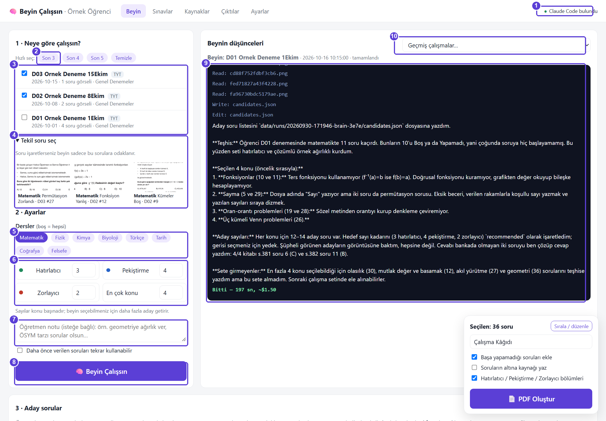
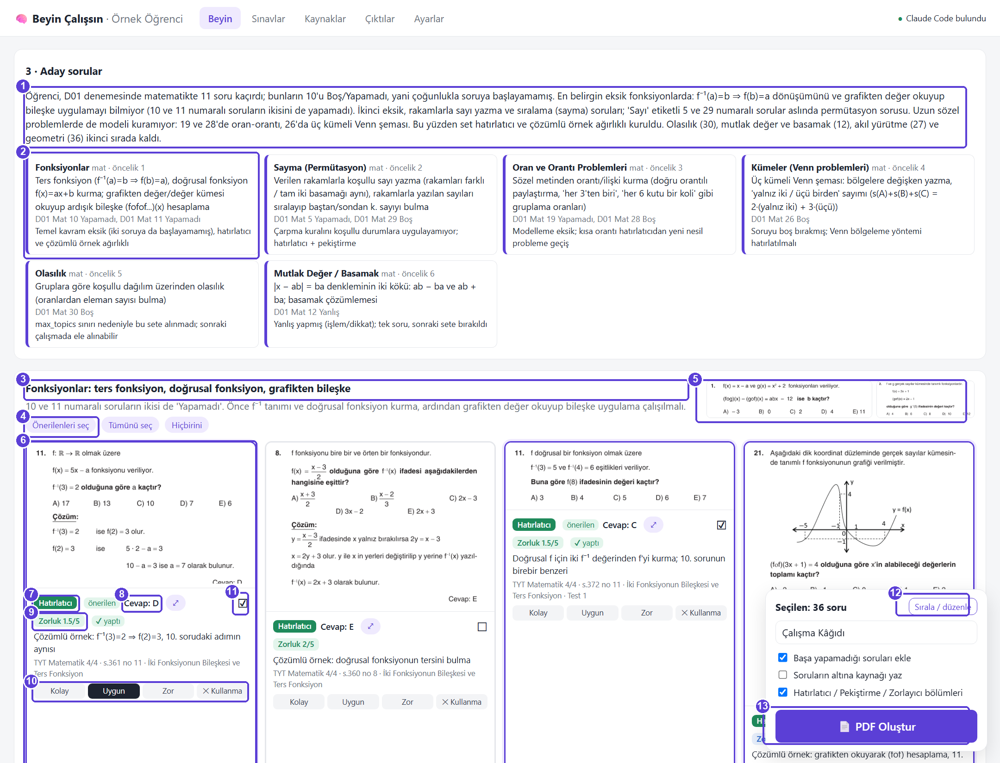
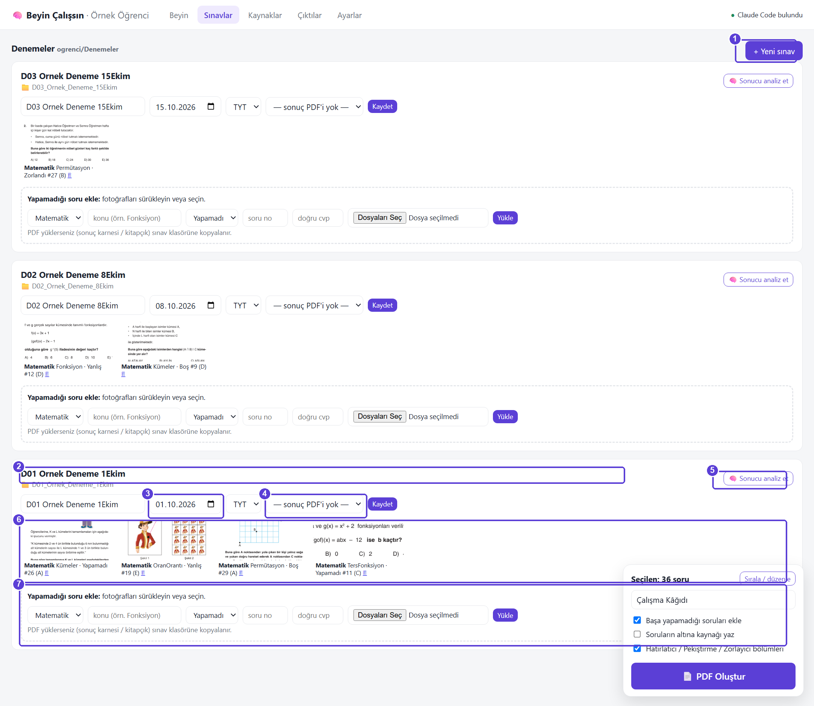
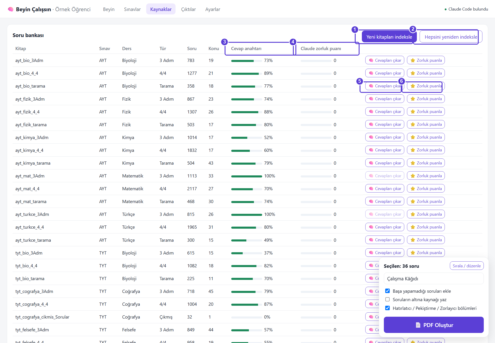
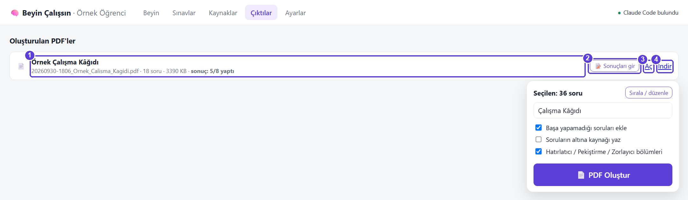
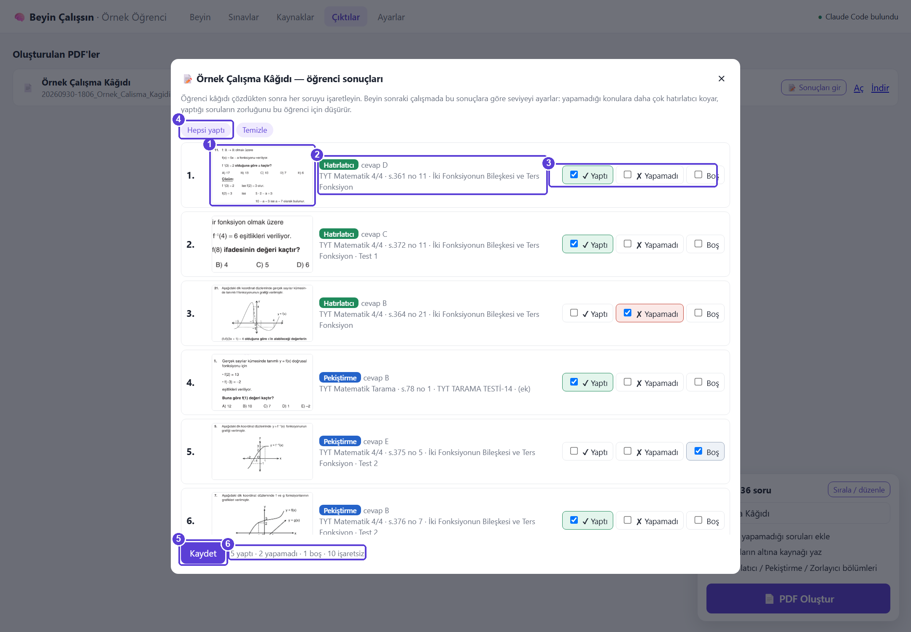
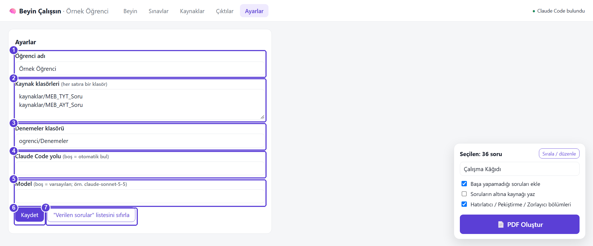
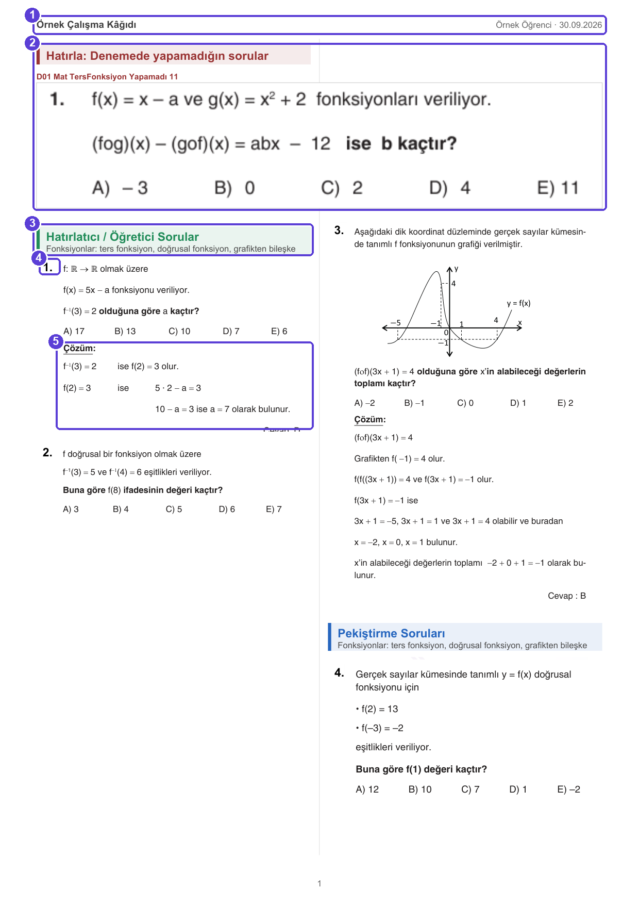
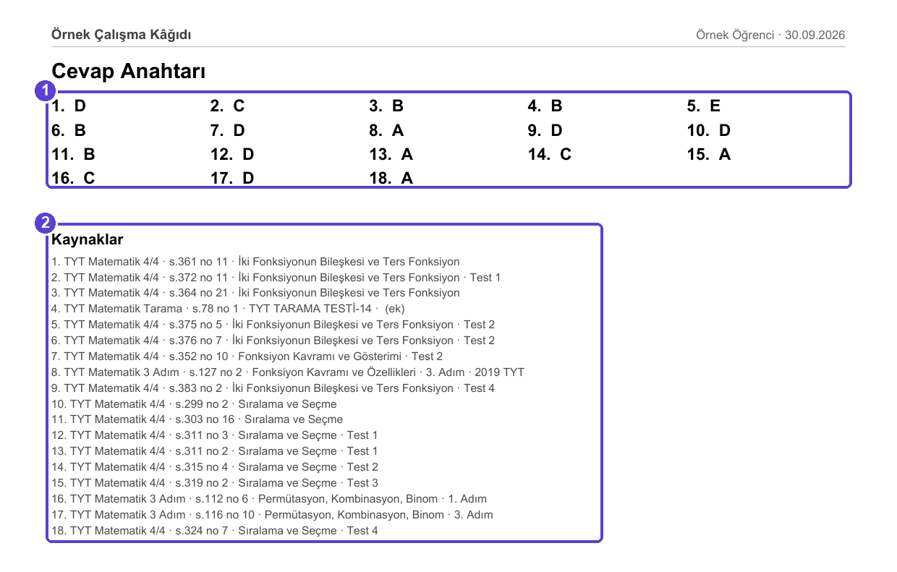

# 🧠 Beyin Çalışsın: Resimli Kılavuz

Bu kılavuz ekran ekran **neresi ne işe yarar** sorusunu cevaplar. Görsellerdeki mor numaralar,
altındaki tablodaki açıklamalara karşılık gelir.

> Ekran görüntüleri "Örnek Öğrenci" adlı bir demo kurulumdan alınmıştır.

**İçindekiler**
0. [İlk kurulum (5 dakika)](#0-ilk-kurulum-5-dakika)
1. [Beyin: neye göre çalışsın?](#1-beyin-neye-göre-çalışsın)
2. [Aday sorular ve seçim](#2-aday-sorular-ve-seçim)
3. [Sınavlar](#3-sınavlar)
4. [Kaynaklar (soru bankası)](#4-kaynaklar-soru-bankası)
5. [Çıktılar ve öğrenci sonuçları](#5-çıktılar-ve-öğrenci-sonuçları)
6. [Ayarlar](#6-ayarlar)
7. [Oluşan PDF](#7-oluşan-pdf)
8. [Döngü: haftalık kullanım](#8-döngü-haftalık-kullanım)
9. [Sık sorulanlar](#9-sık-sorulanlar)

---

## 0. İlk kurulum (5 dakika)

1. **Python 3.12'yi kurun.** Başlat menüsünde "PowerShell" açıp şunu yazın:
   `winget install -e --id Python.Python.3.12`
2. **Claude Code'u kurun ve giriş yapın.** Bir kez yapılır:
   `irm https://claude.ai/install.ps1 | iex` ardından `claude` yazın, açılınca `/login` yazıp Claude
   hesabınızla giriş yapın, sonra `/exit` yazın.
   Claude masaüstü uygulaması kuruluysa sistem onun içindeki Claude Code'u da bulur. Ama yine de bir kez
   `/login` gerekir.
3. **Repoyu indirin.** GitHub'da **Code → Download ZIP** ile indirip bir klasöre açın, ya da
   `git clone` kullanın.
4. Klasördeki **`baslat.bat`** dosyasına çift tıklayın. Siyah pencere açık kalmalı; o sunucudur.
   Chrome'da `http://localhost:8765` kendiliğinden açılır.
5. Sağ üstte yeşil **"Claude Code bulundu"** yazısını görüyorsanız hazırsınız.

Repoda soru bankası (33.000 soru), cevap anahtarları, kaynak PDF'ler ve öğrenci klasörü hazır gelir.
İndeksleme yapmanız gerekmez.

---

## 1. Beyin: neye göre çalışsın?



| # | Ne | Ne işe yarar |
|---|---|---|
| 1 | **Claude Code durumu** | Yeşilse Claude bulundu. Kırmızıysa Ayarlar'dan yol girin ya da kurulumu kontrol edin. |
| 2 | **Hızlı seç** | Son 3 / 4 / 5 denemeyi tek tıkla seçer. "Temizle" seçimi kaldırır. |
| 3 | **Sınav listesi** | En yeni sınav en üstte. Rozetler: `TYT/AYT`, `analiz` (karne çözümlendi), `sonuç` (karne bağlı). |
| 4 | **Tekil soru seç** | Seçili sınavların yanlış soru fotoğrafları. Tıklayıp işaretlerseniz beyin **sadece bu sorulara** odaklanır. |
| 5 | **Dersler** | Sadece bu dersler için çalışır. Hiçbiri seçili değilse hepsi. |
| 6 | **Sayılar** | Konu başına kaç hatırlatıcı / pekiştirme / zorlayıcı soru istediğiniz ve en çok kaç konu seçileceği. Beyin seçim yapabilmeniz için yaklaşık 2 katı aday getirir. |
| 7 | **Öğretmen notu** | Beyne serbest talimat. Örneğin "geometriye ağırlık ver", "ÖSYM tarzı olsun", "çok kolay soru koyma". |
| 8 | **🧠 Beyin Çalışsın** | Claude'u başlatır. 2-4 dakika sürer, yaklaşık 1-2 $ tutar (Claude aboneliğinizden). Butonun üstünde: **Model** (Opus en iyi / Sonnet dengeli / Haiku en ucuz) ve **🔬 Derin analiz**. Derin analizde *soru analisti* ajanı her yanlış soruyu baştan çözüp adım düzeyinde teşhis koyar, her adayı da çözerek denetler (✓ denetlendi rozeti). Maliyeti normal modun yaklaşık 2-3 katı. |
| 9 | **Beynin düşünceleri** | Claude'un yaptıkları canlı akar: hangi fotoğrafı açtığı, bankada ne aradığı, teşhisi. |
| 10 | **Geçmiş çalışmalar** | Önceki beyin çalışmalarını ve adaylarını tekrar açar. |

**Beyin ne yapar?**
1. Yanlış soru fotoğraflarını tek tek açıp **asıl eksik beceriyi** bulur. Dosya adında "Sayı" yazsa bile
   sorunun aslında permütasyon olduğunu görür.
2. Karne PDF'i bağlıysa konu analizini de okur.
3. Öğrencinin daha önceki çalışma kâğıdı sonuçlarına bakar ([5. bölüm](#5-çıktılar-ve-öğrenci-sonuçları)).
4. Soru bankasında konu ve seviyeye göre arar; şüpheli soruların görüntüsüne bakıp eler.
5. Her soruya 1-5 zorluk puanı verir ve adayları yazar.

---

## 2. Aday sorular ve seçim



| # | Ne | Ne işe yarar |
|---|---|---|
| 1 | **Genel teşhis** | Beynin öğrenci hakkındaki özeti: neyi, neden seçtiği. |
| 2 | **Teşhis kartları** | Her eksik konu: eksik beceri, kanıt (hangi soru, Yapamadı/Boş), seviye notu, öncelik. |
| 3 | **Konu grubu** | Adaylar konu konu gruplanır. Altında neden bu konunun seçildiği yazar. |
| 4 | **Toplu seçim** | Grupta önerilenleri, tümünü ya da hiçbirini seçer. |
| 5 | **Yapamadığı soru** | Bu grubun dayandığı yanlış soru fotoğrafları. Tıklayınca büyür. |
| 6 | **Aday kartı** | Kaynaktan kesilmiş gerçek soru. **Karta tıklamak seçer / seçimi kaldırır**; mor çerçeve seçili demek. |
| 7 | **Rol** | 🟢 Hatırlatıcı (temel, çözümlü örnek) · 🔵 Pekiştirme · 🔴 Zorlayıcı (3. Adım / ÖSYM). |
| 8 | **Cevap** | Kaynağın cevap anahtarından gelir. **`*` işaretliyse cevabı Claude çözmüştür; kontrol edin.** |
| 9 | **Zorluk x/5** | Birleşik zorluk. Üstüne gelince dayanağını gösterir (kitap, Claude ⭐, öğretmen, öğrenci). `✔ yaptı` / `✘ yapamadı` rozeti öğrencinin bu soruyu daha önce yapıp yapmadığını gösterir. |
| 10 | **Geri bildirim** | **Kolay / Uygun / Zor / ✕ Kullanma.** Sonraki seçimleri etkiler. "Kullanma" bir daha önermez; kesimi bozuk sorular için kullanın. Tekrar basınca geri alınır. |
| 11 | **Seçim kutusu** | ☑ seçili, ☐ seçili değil. ⤢ soruyu büyütür. |
| 12 | **Sırala / düzenle** | Seçilen soruların listesi: ↑↓ ile sıralayın, rolünü değiştirin, × ile çıkarın. |
| 13 | **📄 PDF Oluştur** | Başlığı yazın, seçenekleri işaretleyin, basın; PDF yeni sekmede açılır. |

**Zorluk nasıl hesaplanır?**

```
kitap seviyesi (1.Adım=2, 2.Adım=3, 3.Adım/ÖSYM=4)
  → varsa Claude puanı (1-5) onun yerine geçer
  → öğretmen: Kolay −1, Zor +1
  → öğrenci: yaptı −0,5, yapamadı +0,5
```

---

## 3. Sınavlar



| # | Ne | Ne işe yarar |
|---|---|---|
| 1 | **+ Yeni sınav** | Yeni deneme klasörü açar. Önerilen ad düzeni: `D05_Yayın_2Ekim`. |
| 2 | **Sınav kartı** | Klasördeki her deneme bir kart olur. |
| 3 | **Tarih / tür** | Tarih ve TYT/AYT. "Son 3" gibi seçimler tarihe göre yapılır. **Kaydet**'e basmayı unutmayın. |
| 4 | **Sonuç PDF'i** | Denemenin karnesini (konu analizi olan PDF) bağlayın; beyin yanlış/boş listesini buradan okur. |
| 5 | **🧠 Sonucu analiz et** | Claude karneyi ve fotoğrafları okuyup netleri ve zayıf konuları çıkarır; kartta tablo olarak görünür. |
| 6 | **Soru fotoğrafları** | Yapamadığı soruların fotoğrafları. Tıklayınca büyür; 🗑 ile `.silinenler` klasörüne taşınır. |
| 7 | **Soru fotoğrafı ekle** | Durumu seçin (**Yapamadı / Yanlış / Doğru-Tereddütlü**), fotoğrafları sürükleyip bırakın; yükleme kendiliğinden başlar. Ders, konu, no ve cevap **isteğe bağlı**; beyin fotoğraftan kendisi bulur. Doğru yaptığı soruları yüklemeye gerek yok. |

**Fotoğraf dosya adı düzeni** (elle koyarsanız):
`<SınavKodu>_<Ders>_<Konu>_<Durum>_<SoruNo>_<DoğruCevap>.jpeg`
Örnek: `D01_Mat_Fonksiyon_Yapamadı_10_E.jpeg`. Durum şunlardan biri olur: `Yanlış`, `Boş`, `Yapamadı`,
`Zorlandı`.

İpucu: Telefonla çekilen fotoğrafta sadece soru görünsün; kırpılmış fotoğraf beyni daha iyi çalıştırır.

---

## 4. Kaynaklar (soru bankası)



| # | Ne | Ne işe yarar |
|---|---|---|
| 1 | **Yeni kitapları indeksle** | Kaynak klasörüne yeni PDF eklediyseniz sadece onları tarar (kitap başına 5-15 sn, yapay zekâsız). |
| 2 | **Hepsini yeniden indeksle** | Tüm kitapları baştan tarar; cevaplar korunur. |
| 3 | **Cevap anahtarı** | Kitaptaki soruların yüzde kaçının cevabı biliniyor. |
| 4 | **Claude zorluk puanı** | Kaç soruya Claude puan vermiş. |
| 5 | **🧠 Cevapları çıkar** | Kodla okunamayan cevap anahtarlarını Claude okur ve tamamlar. |
| 6 | **⭐ Zorluk puanla** | Claude kitaptaki soruları toplu puanlar. Kaç soru olacağını siz seçersiniz; 80 soru yaklaşık 3-5 dakika sürer. |

Sayfanın altındaki **Elle soru ara** ile konu, kelime ve seviyeye göre bankada arama yapabilir, bulduğunuz
soruyu karta tıklayıp doğrudan seçime ekleyebilirsiniz.

**Kaynak PDF adları** ders ve türü belirler: `tyt_mat_3Adm.pdf`, `ayt_fizik_4_4.pdf`,
`tyt_bio_tarama.pdf`, `tyt_tarih_cikmis_Sorular.pdf`.

---

## 5. Çıktılar ve öğrenci sonuçları



| # | Ne | Ne işe yarar |
|---|---|---|
| 1 | **PDF bilgisi** | Başlık, dosya adı, soru sayısı; sonuç girildiyse "5/8 yaptı". |
| 2 | **📝 Sonuçları gir** | Öğrenci kâğıdı çözdükten sonra hangi soruları yaptığını işaretleyin (aşağıda). |
| 3 | **Aç** | PDF'i tarayıcıda açar (yazdırmak için). |
| 4 | **İndir** | PDF'i bilgisayara indirir (WhatsApp / e-posta ile göndermek için). |



| # | Ne | Ne işe yarar |
|---|---|---|
| 1 | **Soru önizlemesi** | PDF'teki sıra numarasıyla aynı. Tıklayınca büyük hali açılır. |
| 2 | **Rol ve cevap** | Hangi bölümdeydi, doğru cevap neydi, kaynağı. |
| 3 | **✔ Yaptı / ✘ Yapamadı / Boş** | Her soru için birini işaretleyin; tekrar tıklayınca kalkar. |
| 4 | **Hepsi yaptı / Temizle** | Hızlı işaretleme. |
| 5 | **Kaydet** | Sonuçlar kaydedilir; sonraki beyin çalışması bunları dikkate alır. |
| 6 | **Özet** | Kaç yaptı, kaç yapamadı, kaç işaretsiz. |

---

## 6. Ayarlar



| # | Ne | Ne işe yarar |
|---|---|---|
| 1 | **Öğrenci adı** | PDF'lerin üst bilgisinde görünür. |
| 2 | **Kaynak klasörleri** | Soru kitabı PDF'lerinin klasörleri. Göreli yol (`kaynaklar/...`) program klasörüne göre çözülür. |
| 3 | **Denemeler klasörü** | Öğrencinin sınav klasörleri (`ogrenci/Denemeler`). |
| 4 | **Claude Code yolu** | Boş bırakın; otomatik bulunur. Bulunamazsa `claude.exe` yolunu yazın. |
| 5 | **Model** | Boş = varsayılan. Daha ucuz / hızlı çalışma için örneğin `claude-sonnet-5-5`. |
| 6 | **Kaydet** | Ayarları kaydeder. |
| 7 | **"Verilen sorular" listesini sıfırla** | PDF'e konmuş sorular normalde tekrar önerilmez; bu buton o listeyi sıfırlar. |

---

## 7. Oluşan PDF



| # | Ne |
|---|---|
| 1 | Üst bilgi: başlık, öğrenci adı, tarih. |
| 2 | **Hatırla:** öğrencinin denemede yapamadığı sorular ("Başa yapamadığı soruları ekle" seçiliyse). |
| 3 | Bölüm başlığı: rol (Hatırlatıcı / Pekiştirme / Zorlayıcı) ve konu. |
| 4 | Yeni soru numarası. Kaynaktaki numara kapatılır, sorular 1'den başlar. |
| 5 | Çözümlü örneklerde çözüm de yer alır; öğretici etki için bilerek seçilir. |

Sorular kaynak PDF'ten **vektör** olarak alınır; yazdırınca bulanıklaşmaz.



| # | Ne |
|---|---|
| 1 | **Cevap anahtarı** (son sayfa). Öğrenciye vermeden önce ayırabilirsiniz. |
| 2 | **Kaynaklar:** her sorunun kitabı, sayfası, konusu, seviyesi. |

---

## 8. Döngü: haftalık kullanım

```
Deneme olur
  → Sınavlar: yapamadığı soruların fotoğraflarını yükle, karneyi bağla
  → Beyin: son 3 denemeyi seç, 🧠 Beyin Çalışsın
  → Adaylar: kontrol et, geri bildirim ver, seç → 📄 PDF
  → Öğrenci çözer
  → Çıktılar: 📝 Sonuçları gir
  → (sonraki hafta beyin bu sonuçlarla daha isabetli seçer)
```

---

## 9. Sık sorulanlar

**"Claude Code oturumu açık değil" diyor.**
Terminalde `claude` yazıp `/login` ile giriş yapın; bir kez yeterlidir.

**Bir sorunun kesimi bozuk ya da yarım.**
Karttaki **✕ Kullanma** butonuna basın; o soru bir daha önerilmez.

**Cevabın yanında `*` var.**
Kaynağın anahtarında o sorunun cevabı yoktu, Claude kendisi çözdü. PDF'e koymadan önce kontrol edin.

**Beyin çalışması ne kadar tutar?**
Bir deneme ve tek ders için yaklaşık 3 dakika, 1-2 $. Ayarlar'dan daha hafif bir model seçerek
düşürebilirsiniz.

**Yeni kaynak kitap eklemek istiyorum.**
PDF'i kaynak klasörüne `tyt_<ders>_<tür>.pdf` adıyla koyun, **Kaynaklar → Yeni kitapları indeksle**'ye
basın.

**Sistemi kapatmak.**
Siyah `baslat.bat` penceresini kapatın. Tekrar açmak için `baslat.bat`'a çift tıklayın.
